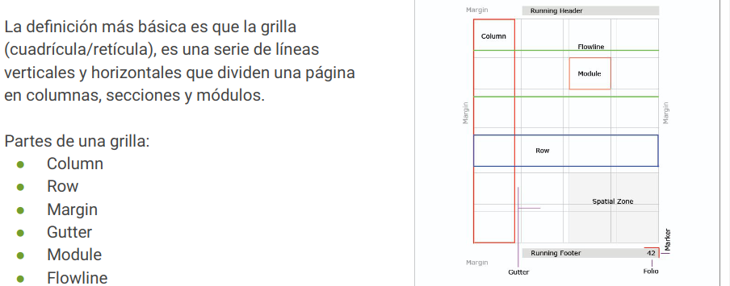

# Taller - Figma

## Objetivo
Este taller tiene como objetivo realizar practicas en Figma, para reforzar mi lado de UX/UI.

## UX/UI
## Herramientas basicas de Figma
### Secciones y herramientas de Figma

### Elementos basicos

### Plugins
- Que es?
  - Son extensiones o complementos que añaden funcionalidad adicional. 
  - **Unsplash** sirve incorporar imágenes y Material symbols para trabajar iconos

### Elementos intermedios
- Autolayouts
  - Crea frames que se adaptan al contenido, sin hacerlo de forma manual. 
- Atomic design
  - Metodo de diseño que descompone los componentes de la interfaz en elementos pequeños llamados atomos.
  - Permite crear una interfaz modular y escalable.
  - Atomos: componentes mas basicos
    - Ejemplo: botones, etiquetas, campos de entrada, iconos.
  - Molecula: grupo de atomos, para formar componentes.
  - Organismo: componentes mas grandes y complejos.
  - Templates: esquemas basicos que definen la estructura de una pagina.
  - Paginas: representacion visual final del diseño compuesta por componentes.
- Componentes
  - Son una agrupación de una o varios elementos, que pueden ser reutilizables.
    - Componente principal: define las propiedades y retrincciones. Ej. boton  menu desplegable.
    - Instancia: copia del componente principal, heredan las propiedades pero tambien se pueden agregar propias.
- Variantes
  - Permite crear varias versiones de un mismo componente master, cada una con propiedad y estilos diferentes.
  - Especialmente para crear botones o menus desplegables.
- Propiedade
  - Son los atributos.

### Creando interacciones

- Que son:
  - Las interacciones en diseño UI se refiere a las formas en que los usuarios interactúan con un producto digital, como una aplicación o un sitio web. 
  - Estas interacciones pueden incluir gestos táctiles, clics de mouse, desplazamiento de la pantalla, movimientos del cursor, entradas de teclado y más.
- Microninteracciones:
  - Las microinteracciones son pequeñas animaciones o respuestas que ocurren en una interfaz de usuario cuando este interactúa con ella. 
  - Estas microinteracciones son una parte importante del diseño de la experiencia de usuario y pueden mejorar en gran medida la usabilidad y el atractivo visual de una aplicación o sitio web.
- Interaccion entre elementos esta formada por:
  - Un disparador (trigger), una acción y un destino.
- Un trigger  tiene las siguientes opciones:
  - **On click/On Tap:** Activa la acción cuando elusuario  hace clic en un punto del frame oelemento en la pantalla.
  - **On drag:** Activa una acción cuando arrastra unpunto del frame o elemento en la pantalla.
  - **While Hovering:** Activa la acción cuando elmouse se desplaza sobre el punto de acceso.
  - **While pressing:** Activa la acción cuando haceclic y mantiene  presionado el mouse.
  - **Key/Gamepad:** Te permite replicarinteracciones con un atajo de teclado.
  - *Mouse enter:* Se activa al ingresar en un áreaespecífica.
  - *Mouse leave:* Se activa al salir de un áreaespecífica.
  - *Touch/mouse down:* Se activa al momento en que el usuario toca un elemento para iniciar una acción.
  - *Touch/mouse up:* Se activa al momento en que el usuario levanta el clic/touch de un elemento para iniciar una acción.
- Una accion tiene las siguientes opciones:
  - **Navegate to:** Esta acción lo lleva de un cuadro enun prototipo a otro.
  - **Open Overlay:** Esta acción abre el  cuadro dedestino por encima del cuadro actual.
  - **Swap overlay:** Crea una animación donde la pantalla actual se desvanece mientras una nueva pantalla se desliza desde el lado opuesto
  - **Close overlay:** Se utiliza para cerrar una capa o elemento superpuesto que se ha abierto sobre la interfaz de usuario principal.
  - *Back:* Esto le permite volver a la pantallaanterior, y simular el botón Atrás.
  - *Scroll to:* Esta acción permite generar undesplazamiento a cualquier elementodentro del frame.
  - *Open link:* Permite linkear un enlace a cualquier elemento del frame.Fuente: ADL

