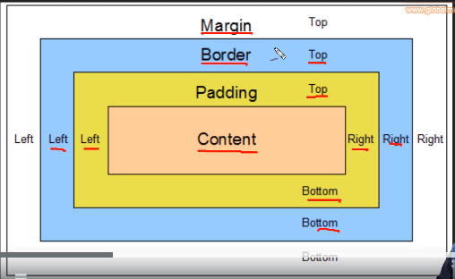

# Introducción a CSS

## MAnejo de padding, border y margin

  
- `margin: 40px 10px 20px 10;` -> margin: top, rigth, bottom, left;
- para centrar de forma horizontal, se usa `margin:auto; o margin:auto 50px;`

## Paleta de colores
- [Paleta de colores de Coolors.co](https://coolors.co/)
  

## Frameworks CSS
- Bootstrap
- Foundation
- Bulma 
- Semantic UI
- Tailwind
- UI kit