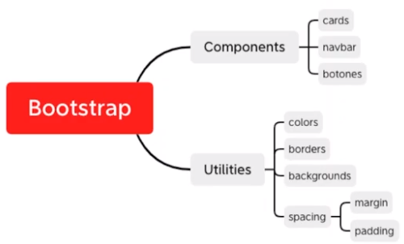
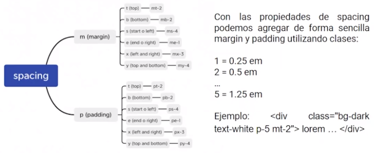
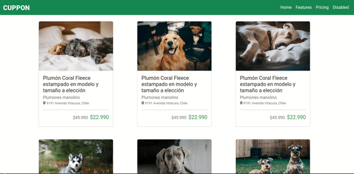
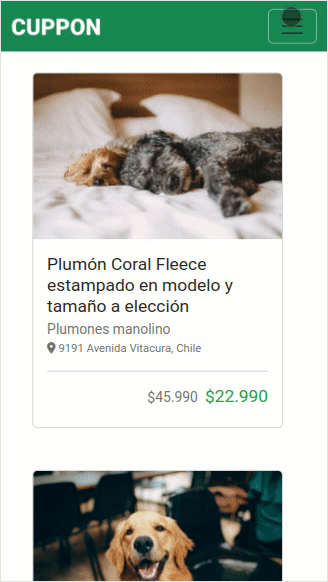

# INTRODUCCION A DESARROLLO WEB

## Introducción a HTML
- [x] ¿Que es HTML?
- [x] Etiquetas
- [x] Encabezados y comentarios
- [x] Lista de elementos -> `<ol>` (ordered list) -  `<li>` (list item) y `<ul>` (unordered lists) - `<li>` (list item)
- [x] Ejercicio CV
- [x] Imagenes y enlaces -> en `<a>` target="_blank se usa para aprir el enlace en otra pestaña.
- [x] Tablas
  - combinar 2 o mas columnas: `colspan = 2`
  - combinar 2 o mas filas: `rowspan=2`
  - En css: `tr:nth-child(even o odd){...}` even selecciona los pares y odd los impares
- [x] Optimizacion de imagenes:
  -  Imagenes:
     - [https://tinypng.com/](TinyPNG): permit optimizar imagenes.
     - [kraken.io](kraken.io)
     - [remove.bg](remove.bg): eliminar fondo.
  - Atajos de teclado:
     - alt + click: coloca el cursor en varias lineas y permite editar en simultaneo.
     - shift + alt + |v : crea copias de una o  mas lineas de mandera simultanea, cortar y pegar en silmultaneo.
     - alt + |v o |^ : desplazar hacia arriba o hacia abajp una o mas lineas. 
- [x] Formato para enviar un email mediante link
  - `<a href="mailto:example@gmail.com?subject=Contacto&body=prueba email">Enviar</a>`

  
### Formatos de texto:
 - ` ` line break
 - `
` horizontal rule
 - `<b></b>` texto en negrita <b>ejemplo</b>
 - `<strong></strong>` texto en negrita, pero indica que es importante <strong>ejemplo</strong>
 - `<i></i>`texto en <i>ejemplo</i>
 - `<em></em>`texto para enfatizar <em>ejemplo</em>
 - `<small></small>` texto normal pero pequeño <small>ejemplo</small>
 - `<mark></mark>` texto marcado <mark>ejemplo</mark>
 - `<del></del>` texto eliminado <del>ejemplo</del>
 - `<ins></ins>` texto insertado <ins>ejemplo</ins>
 - `` para sub-indices H2O
 - `` para indices superiores x2+1

### Referencias de caracteres
- `<code></code>` para poner código <code>let a = 1</code>
- `&num;` para agrear simbolos de acuerdo a su referencia
	- [Character entity reference](https://tools.w3cub.com/html-entities)

### Formularios
- GET y POST:
  - Por defecto para enviar datos es el metodo GET, en url.
  - El metodo post tambien se puede usar para enviar datos sensibles sal servidor, pero se envia dentro de un request.

- Posibles atributos de form:
  - action: servidor
  - method: post y get
  - target: se actualiza en la misma pagina o n otra
  - autocomplete: on y off, el navegaador puede mostrar sugerencias

### Etiquetas estructurales en HTML

- `<header></header>`
- `<nav></nav>`
- `<section></section>`
- `<article></article>`
- `<footer></footer>`
- `<aside></aside>`
- `<hgroup></hgroup>`

## Introducción a CSS

CSS -> CascadingStyleSheets

- [x] Selectores
   - Etiquetas: cuando se quiere cambiar todas las etiquetas de ese tipo.
   - . : cuando se quiere cambiar algunos elementos, en class.
   - #: como identificador, solo queremos cambiar un unico elemento.
   - *: es un selector CSS universal que aplica a todas las etiquetas.
- [x] Modelos de caja
  - padding: es como un relleno interno, es siempre trasnparente.
  - border: todolos contenidos son como cajas
  - margin: asigna al lado derecho, inferior e izquierdo, un espaciado externo.
  - Modelo en cascada: si hay varias propiedades css a una etiqueta, prevalece la ultima regla.
- [x] Colores
  - Hay 17 colores básicos definidos como palabras clave y 147 colores extendidos. Fuente: [CSS color](https://www.w3.org/TR/css-color-3/) y [Html color codes](https://htmlcolorcodes.com/es/)
  - RGB significa red, green and blue,osea rojo, verde y azul, toman valores de 0 a 255.
  - RGB porcentual, similar al RGB pero en porcentaje del 0% al 100%(255).
  - RGB hexadecimal, se puede convertir a un valor hexadecimal.
- [x] Tipografia
  - Se puede cambiar la tipografia, usando la propiedad **font-family**.
  - Unidades y tamaño usando **font-size**.
- [x] Problemas con px
  - em y rem
    - em:La unidad “em” no siempre mide lo mismo, ya que su tamaño depende del tamaño del elemento padre. Por lo tanto, se trata de una unidad relativa. **Nota: 1em base mide 16px**
    - rem:La unidad rem(rootem) es relativa solo al tamaño del elemento raíz del elemento HTML tiene un tamaño de fuente de 16px(como es por defecto)entonces **1rem sería igual a 16px** sin importar el tamaño del elemento padre.
- [x] Grosor y cursiva
  - font-weight: grosor de la letra.
  - font-style: estilo de la letra.
- [x] Fondo
  - background-color: color de fondo.
  - background-image: imagen de fondo.
  - background-position: posicion del elemento de fondo.
  - background-repeat: indica si la imagen se repite o no.
  - background-size: tamaño de la imagen de fondo.
- [x] Alineacion del texto
  - text-align: alineacion del texto.

### Resultado del desafio

## Alinenado contenido con flex

- display block: Cada linea es un bloque y no se puede poner otro a lado, ocupa todo el ancho disponible. Hay etiquetas que tienen este comportamiento.
- display inline: su `ancho ocupa el minimo espacio. <a> <stron> <em>` son etiquetas inline.
  - se puede establecer un ancho y alto
  - contruiri un menu.
  - construir una galeria de imagenes.
- Flexbox: `dispĺay:flex` alinea contenido. Ideal ara construccion de layouts que contengan elementos de filas y columnas.
  - justify-content: start, end, center.
  

  - flex-wrap: nowrap(xdefecto) hace que los elementos aparezcan en una unica linea.
  Son selectores que en lugar de apuntar a un elemento apuntan al estado de un elemento.

- Etiquetas semanticas: cumpleen el mismo rol.

### Resultado del desafio

## Bootstrap
-[Bootsrap](https://getbootstrap.com/docs/5.3/getting-started/introduction/)
### Componentes y utilidades de boootstrap

### Spacing

### Resultado del desafio
#### Version desktop del desafio de CUPPON
  

#### Version mobile del desafio de CUPPON
  

## Terminal, Git y GitHub
### Comandos iniciales
- `pwd`: conocer en que directorio estamos.
- `ls`: listar el contenido del directorio.
- `.`: son archivos ocultos.
- `mkdir`: crear carpetas.
- `touch`: crear un archivo.
- `code`: editar en el archivo en un editor de codigo.
- `cp archivo.extension ruta_destino/archivo_nuevo.extension` para la copia de archivos.
- `cp -r directorio_copiado directorio_destino`: copiar directorios.
- `mv archivo.extension directorio_destino/`: mover archivos.
- `mv directorio_origen directorio_destino`: mover directorios.
- `rm archivo.extension`: eliminar un archivo. Estos archivos no se recuperan
- `rm -r directorio`: eliminar un directorio completo.
  
### Confirguracion de git:
- `git config --global user.name "Tu nombre"`
- `git config --global user.email Tucorreo@mail.com`
- Con `git config --list` veremos los datos
- git log: listado global de los cambios
- git add . agrega todos los archivos de git untracked a tracked

- Generacion de clave ssh
  - `ssh-keygen -t rsa -b 4096 -C "aqui contraseña"`
  - `eval "$(ssh-agent -s)"`
  - ssh-add ~/.ssh/id_rsa

### Resultado del desafio

## Trabajo colaborativo y github pages
- Permite levantar una pagina web gratuita a partir de un repositorio en github.
  - Podemos usarlo para subir nuestro CV y portafolio.
  - Un sitio web para cad proyecto y poder presentarlos.

### Ejercicio
[Ejercicio de Github pages](https://alceaxich.github.io/prueba-ghp/)